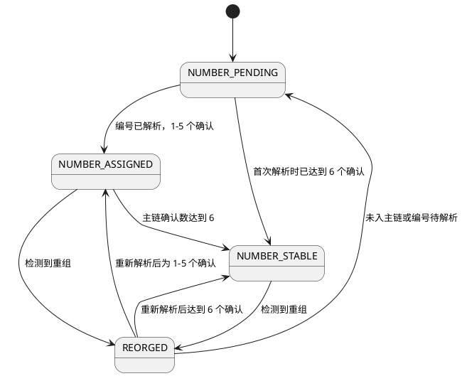

# Ownword 核心认知

> **Own your identity. Own your words.**
>
> 拥有你的身份，为你的言论负责。

## 0. 文档定位

本文是 Ownword 产品、设计、原型、代码和测试的**唯一事实来源（SSOT）**。

- 本文只保存跨模块、跨版本必须稳定的认知，不复述页面细节。
- `设计文档V6.md` 是本文的直接设计依据；外部协议和代码是技术事实依据。
- 本文与设计稿、原型、代码或普通设计文档冲突时，以本文为准。
- 新需求先修改本文，再同步设计、原型、代码和测试。禁止在下游重复定义同一规则。
- 未经协议或可执行代码验证的结论，必须标记为“待确认”，不得写成既定事实。

规范词：

- **必须/禁止**：不可违反的产品或技术约束。
- **应该**：默认实现；偏离时必须记录原因。
- **可以**：允许但非必需。

## 1. 是什么

Ownword 是以**区块链 Identity 为中心**的个人或组织身份、关系与内容平台。

平台回答三个问题：

1. **Who am I?** — Identity
2. **What did I say?** — Words
3. **Can it be proven?** — Proof

三个根原则：

1. **Identity belongs to the user.** Identity 由用户 Wallet 控制，不属于平台账户。
2. **Words are signed by the identity.** 发布内容必须能归属并验证到明确 Identity。
3. **Blockchain is the source of truth.** 链上事实以 Bitcoin sv为最终依据，数据库只保存草稿和派生数据。

核心模型：

```text
Wallet（控制能力）
  ↓
BAP Identity（产品中心）
  ├── Words
  ├── Relationship
  └── Identity Artifact
          ↓
        Bitcoin（链上事实）
```

Wallet 是基础设施，Identity 是产品中心。Words、Relationship、Artifact 是 Identity 的平行能力；Artifact 不是使用其他能力的前置条件。

所有由 Ownword 发起或委托构造的链上交易，都必须使用 `identityKey` 执行身份签名，并能验证归属到明确 BAP ID。具体范围和签名边界以第 6.4 节为准。

## 2. 术语与命名

### 2.1 领域术语

| 术语 | 唯一定义 |
| --- | --- |
| Wallet | 管理密钥、权限、资产、签名和交易能力的非托管钱包；不是平台账号或 Identity |
| Yours Wallet | MVP 默认支持、基于 BRC-100 的 Wallet |
| Wallet Provider | 平台对 Wallet 能力的统一抽象 |
| BAP Identity | 由 BAP 定义、用户 Wallet 控制的主权数字身份 |
| BAP ID | 由 Identity 根密钥确定性派生的稳定、公开身份主标识 |
| identityKey | 本产品指 BAP 当前有效的身份签名密钥，私钥由 Wallet 持有；与 BAP ID 字符串、UTXO 花费密钥及 BRC-100 API 的钱包根身份公钥参数分别处理 |
| BAP Profile | Identity 的可修改展示信息；不是 Identity 本身 |
| Key Rotation | 保持 BAP ID 不变，更新当前签名路径 |
| Words | 用户侧内容概念；MVP 对应一条 Markdown Post |
| Content Revision | 已发布内容的新链上版本；不能覆盖旧版本 |
| Proof | 对签名、协议、标识、交易和链上状态的可验证说明 |
| Identity Artifact | 与 Identity 关联的 1Sat Ordinal 资产，以 Inscription Number 提供可记忆的数字 ID，并承载视觉表达；领域实体名为 `BapNFT` |
| Binding | Identity 与 Artifact 的独立关联记录 |
| Inscription ID | 某次 Inscription 的输出标识，格式 `txid_vout` |
| Inscription Number | Inscription 确认后按区块顺序分配的编号，用作可记忆的数字 ID；经有效 Binding 查找 BAP Identity；稳定状态遵循第 9.4 节，受 reorg 影响 |
| OpNS Name | 后续考虑的可记忆名称；本期不实现，不替代 Inscription Number 的数字 ID 角色 |
| Ordinal Number | 精确标识 satoshi 的编号 |
| Origin | 当前 1Sat 单聪输出链的起点；Ordinal 被装入大于 1 satoshi 的 Output 后不再延续 |
| Outpoint | 当前交易输出；Artifact 转移后改变 |
| Relationship | Identity 与 Identity 的关系；双方始终用 BAP ID 标识 |
| Transaction | 链上操作对应的 Bitcoin sv 交易 |

### 2.2 用户术语与协议术语

普通界面优先使用：

```text
Identity / Profile / Words / Identity Artifact
Publish / Signature / Transaction
```

协议细节通过 Details 或 Proof 渐进披露：

```text
BAP / B / MAP / AIP / Ordinal / Origin / Outpoint / BEEF
```

两个主标识不得降级为隐藏协议细节：

- Identity 的主标识是 **BAP ID**。
- **Inscription Number** 是用户记忆、展示和查找 Identity 的数字 ID；其链上对象仍是 Artifact，解析到 Identity 必须经过有效 Binding。

### 2.3 用词禁区

- 禁止把 Wallet Connection 称为传统“注册账号”或“登录账号”。
- 禁止用 `Verified Identity` 表示仅通过密码学签名验证的 Identity。
- 应使用 `Signature valid` 或 `Signed by this identity`；它不证明现实人物身份。
- 禁止把 Identity Artifact 的主要操作写成 `Create BAP NFT`；用户侧统一为 `Create Artifact`。
- 同一操作和状态必须使用同一文案，禁止在 `Publish / Submit / Broadcast / Push` 间随意切换。

## 3. 目标

用户必须能够：

1. 使用自己的 Wallet；
2. 创建、拥有、查看和维护 BAP Identity；
3. 用明确 Identity 签名并发布 Words；
4. 在 Bitcoin 上独立验证 Identity、签名、内容和交易；
5. 通过 BAP ID 查找 Identity；
6. 创建或选择自己持有的可选 Identity Artifact，以 Inscription Number 作为可记忆数字 ID，查找其当前关联 Identity；
7. 离开平台后仍保有 Identity、已发布内容和 Artifact；
8. 后续以 BAP ID 建立 Identity 关系。

体验必须满足：

- **易用性**：用户完成目标前不必学习底层协议。
- **一致性**：相同行为使用相同组件、文案、状态和交互。
- **确定性**：用户始终知道当前 Identity、发生的动作、业务结果和下一步。
- **可验证性**：关键链上结果能追溯到原始标识、签名和交易。

## 4. 全局不变量

以下规则优先于所有页面和实现细节：

1. `BAP Identity != WalletConnection != BAPProfile != Identity Artifact`。
2. BAP ID 稳定且不可编辑；Profile 可修改；Key Rotation 不改变 BAP ID。
3. Identity 可在没有 Artifact 时被查找、建立 Relationship、写作和发布。
4. 一个 Identity 可以关联多个 Artifact，但有效 Current Artifact 最多一个。
5. `creator`、签名者、当前 owner、Current Binding 是四个独立概念，禁止互相推断。
6. 已发布内容不可覆盖；修改必须创建 Revision，旧版本保持公开。
7. Content 产品状态、Transaction/Blockchain 状态必须独立建模。
8. Inscription Number 只在确认后存在，禁止预估或本地分配；reorg 后允许变化。
9. Inscription Number 是可记忆数字 ID，不替代 BAP ID；查找须先定位 Artifact 再验证 Binding，Content 归属与 Relationship 端点始终保存 BAP ID。
10. 展示值可以缩略，复制和协议输入必须使用完整原始值。
11. Wallet 连接不等于自动签名授权；需授权的操作必须交由 Wallet 确认。
12. 用户拒绝或关闭 Wallet 是 `Cancelled`，不是系统 `Failed`。
13. Locale、Theme 和 Copy 状态只影响 UI，不得进入签名输入或改变链上事实。
14. 数据库缓存不能替代 Bitcoin 或可重建的 Indexer 事实。
15. 所有链上交易必须满足第 6.4 节的 identityKey 身份签名约束；钱包连接、付款、UTXO 花费签名或写入 BAP ID 字段都不能替代该证明。

## 5. 结构

### 5.1 模块

MVP 模块：

```text
Wallet / Identity / Content / Artifact / Explorer
```

后续模块：

```text
Relationship / Attestation / Messaging
```

横切能力：

```text
Internationalization / Theme
Identifier Display & Copy / Exact Identifier Lookup
Proof / Transaction Tracking / Error Semantics
```

### 5.2 接口边界

业务层只依赖以下抽象：

| 接口 | 职责 |
| --- | --- |
| `WalletProvider` | Wallet 会话、权限、身份上下文和通用交易能力 |
| `IdentityProvider` | BAP ID 计算、解析、发布、Profile、Rotation，以及 identityKey 签名归属验证 |
| `ContentProtocol` | 内容编码、签名和发布 |
| `RelationshipProtocol` | Identity 关系编码和发布 |
| `OrdinalProvider` | Inscribe、查询 Wallet 当前 Ordinal Output、Transfer |
| `BlockchainIndexer` | 解析交易、编号、Origin、Outpoint、链状态和派生元数据 |
| `IdentifierResolver` | 将 BAP ID 或 Inscription Number 解析为 Identity、Artifact、Binding |

禁止业务组件直接依赖 Yours Wallet API。适配关系必须为：

```text
业务组件 → 领域接口 → Yours Wallet Adapter / Indexer Adapter
```

Inscription Number 所需的编号解析、精确查找、确认数与重组追踪等缺失能力，后续由 metanet4j 提供 API 补齐。metanet4j 是链上事实的解析与服务层，不自行分配编号，也不以数据库记录替代链上事实。具体接口签名、路径及部署未确定前，不在原型中宣称已经接入；本期使用可控样例表达行为。

### 5.3 事实来源

| 事实 | 权威来源 |
| --- | --- |
| Identity 发布、Published Content、Signature、Ordinal Ownership、Transaction | Bitcoin |
| BAP ID 的本地确定性计算 | Wallet/BAP 密钥派生；公开存在性须由公共 BAP 链上解析结果确认，不能只凭钱包本地记录 |
| Inscription Number、Ordinal Number、Origin、Current Outpoint、MAP merge | 可重建的 Indexer 解析结果 |
| Draft、搜索索引、缓存、UI 偏好、交易跟踪 | 应用数据库 |
| 私钥、Seed Phrase、签名授权 | 用户 Wallet |

查询派生事实必须保留来源、更新时间和重新解析能力。

## 6. 功能

### 6.1 MVP

#### Wallet

- 发现并连接 Yours Wallet。
- 显示压缩后的连接状态。
- Account Switch 时终止待处理敏感操作，清除旧 Identity 上下文，再解析新 Identity。

#### Identity

- 连接后自动 `computeBapId`，结合钱包身份记录和公共 BAP 解析结果分流；SDK 的 `resolveBapId` 不自动等于公共链上解析。
- 已发布 Identity 进入 My Identity；未发布 Identity 进入 Setup；Profile 不完整进入补全流程。
- Setup 在体验上合并 Identity 发布和 Profile 创建，但领域操作保持独立。
- 支持 Profile 修改、Public Identity、BAP ID 精确查找与复制、Key Rotation。

#### Content

- 创建和导入 UTF-8 Markdown Draft。
- Write、Preview、Review 后用明确 Identity 执行 `Sign & Publish`。
- MVP 链上协议为 `B + MAP(type=post) + AIP`。
- 发布取消时保留 Draft；成功广播并被网络接收后，业务状态可为 Published，确认状态单独展示。
- 已发布内容只允许 `Create Revision`。

#### Identity Artifact

- 创建 1Sat Ordinal Artifact，或选择钱包已持有的 Artifact；创建成功后默认尝试设为 Current Artifact，创建与 Binding 的结果分别反馈。
- 创建时请求 BAP identity signing，写入 `ord` 所需 MAP 字段。
- 编号由 Indexer 回填，展示待确认、已分配和稳定状态；判定规则以第 9.4 节为准，不在本地预估或发号。
- 支持多 Artifact、切换 Current Artifact、Transfer 后重新校验 ownership 和 Binding。
- Artifact 详情分层展示 Inscription Number、Associated BAP ID，以及 Proof 标识。

#### Explorer 与偏好

- 使用完整 BAP ID 或 `165`/`#165` 精确查找。
- BAP ID 直接解析已发布 Identity；Inscription Number 经 Artifact、Origin、Current Binding 解析 Identity。
- 默认语言为英文，可切换 `zh-CN`；用户选择持久化。
- 支持 Light 与 Dark；组件使用语义 Token，并满足 WCAG AA。

### 6.2 后续能力

```text
Reply / Repost / Follow / Unfollow / Friend / Like
Message / Tag / Attachment / Attestation
OpNS Name（可记忆名称，本期不处理）
```

后续能力优先采用 BAP 或 BitcoinSchema 已有协议，禁止无依据创建私有 Schema。

### 6.3 统一高影响操作流

```text
User Intent
  → Review
  → Wallet Confirmation
  → Processing
  → Business Result
  → Blockchain Details
```

Review 必须显示当前操作 Identity、完整可复制 BAP ID、主要影响和将产生的公开结果。

### 6.4 全部链上交易的身份归属

- 所有 Ownword 发起或委托构造的链上交易均须经用户授权，由 Wallet 使用 `identityKey` 签名。范围包括 Identity 首次发布、Profile 更新、Key Rotation、Content 发布和 Revision、Artifact 创建和 Transfer，以及实际产生链上交易的 Binding 变更、支付及后续能力。一次操作拆成多笔交易时，每笔均适用，不得仅签第一笔或主业务交易。
- 身份签名与 UTXO 花费签名职责不同：前者证明操作归属 BAP ID，后者满足被花费输出的锁定条件。两者均须满足，不要求所有输入改用同一身份密钥花费，也不把付款账户推断为操作 Identity。
- 身份签名必须绑定本笔交易的业务内容和关键目标。Review 后改变内容、关联目标或转移目标，必须重新授权和签名；签名失败、缺失、归属不匹配或账户变化时，禁止继续广播，不得静默退回仅有花费签名的交易。
- 首次发布按 BAP 初始身份声明规则建立并验证签名归属；Key Rotation 使用当时有效的身份签名路径授权。历史交易依据签名发生时有效的 BAP 密钥历史验证，不能因当前密钥已轮换而判为无效。
- Proof 必须能追溯交易、操作 BAP ID、身份签名者、签名证据与验证结果；密码学签名有效只证明签名归属，不证明现实人物身份。外部历史交易可以只读展示，但未验证的归属不得显示为有效，也不能据此推导 Current Binding。
- AIP、Sigma 等封装应复用现有协议并经实际交易和验证器确认。SDK 选项名、钱包本地标签或 `signWithBAP: true` 不能单独作为满足本节的证据；封装能力不足由后续钱包适配与 metanet4j 实现补齐，本期原型明确使用签名样例。

## 7. 实体与属性

### 7.1 `WalletConnection`

当前应用与 Wallet 的会话。它只提供上下文和能力，不代表平台 User 或 BAP Identity。

### 7.2 `BAPIdentity`

| 属性 | 约束 |
| --- | --- |
| `bapId: string` | 唯一、必填、稳定、公开主标识 |
| `rootPath: string` | 必填、稳定，定义 Identity 根 |
| `currentPath: string` | 必填、可轮换，表示当前签名路径 |
| `previousPath?: string` | Rotation 历史路径 |
| `type: PERSON \| ORGANIZATION` | 必填 |
| `status` | 必填，遵循 Identity 状态机 |
| `publishTxid?: string` | 发布后必填、不可变 |
| `createdAt` | 必填、不可变 |

### 7.3 `BAPProfile`

| 属性 | 约束 |
| --- | --- |
| `bapId: string` | 唯一、必填、稳定 |
| `name: string` | 必填、可修改、最多 100 字符 |
| `image?: URI` | 可修改、最多 2048 字符 |
| `description?: string` | 可修改、最多 1000 字符 |
| `type: Person \| Organization` | 必填、可修改 |
| `updatedAt` | 必填、可修改 |

### 7.4 `Content`

| 属性 | 约束 |
| --- | --- |
| `id: UUID` | 本地唯一标识 |
| `txid?: string` | 发布后唯一、不可变 |
| `authorBapId: string` | 必填、不可变 |
| `type: POST` | MVP 固定 |
| `content: text` | Draft 可修改，发布后不可变 |
| `mediaType: text/markdown` | MVP 固定，发布后不可变 |
| `encoding: UTF-8` | MVP 固定，发布后不可变 |
| `status` | 必填，遵循 Content 产品状态机 |
| `publishedAt?: datetime` | 发布后必填、不可变 |

### 7.5 `ContentRevision`

每个 Revision 是新 Content 版本，使用 `rootContentId`、`previousContentId`、`revisionNo` 和新 `txid` 串联，不修改旧 Content。

### 7.6 `BapNFT`

| 属性 | 约束 |
| --- | --- |
| `inscriptionId: string` | 唯一、必填、不可变，格式 `txid_vout` |
| `inscriptionNumber?: decimal string` | 确认并解析后存在；reorg 后可变；禁止使用浮点数；不包含显示前缀 `#` |
| `numberStatus` | 编号解析与稳定性派生状态；取值和判定遵循第 9.4 节，与 Artifact、Binding 及交易状态分别保存 |
| `numberConfirmations?: int` | 编号对应铭文交易在当前主链的确认数；未入块为 0，来源不可用时为未知，不能伪装成 0；Transfer 交易的确认数不替代此值 |
| `numberObservedAt?: datetime` | 最近一次成功核实编号、确认数及所在链的时间；派生只读，保留查询来源 |
| `ordinalNumber?: decimal string` | 解析后存在，使用字符串避免精度丢失 |
| `origin: string` | 当前 1Sat 链的领域定位键；burn 后可产生新 Origin |
| `currentOutpoint: string` | 必填，Transfer 后更新 |
| `currentSequence?: int` | 当前 1Sat 转移/重铭刻位置 |
| `contentType`, `contentUri` | Inscription 内容描述 |
| `owner` | 当前 Output 控制者；不得自动解释为 BAP ID |
| `status`, `createdAt` | 产品状态与创建时间 |

### 7.7 `IdentityNFTBinding`

使用 `bapId + ordinalOrigin` 关联 Identity 与 Artifact。状态为 `ACTIVE / HISTORICAL / INVALID`；同一 `bapId` 的 `ACTIVE` Binding 必须不超过一个。

同一 `ordinalOrigin` 同时最多关联一个有效当前 BAP ID，确保数字 ID 精确查找没有歧义。切换 Current 保留旧关联历史，只有有效 ACTIVE Binding 可用于当前 Identity 解析。Binding 的授权证据、公开记录和撤销验证由后续实现契约明确，不得仅以数据库写入、创建者或签名者推导有效绑定。

### 7.8 `Relationship`

后续实体。以 `fromBapId + toBapId + type` 表达双方和语义；Inscription Number 不得保存为关系端点。

### 7.9 `BlockchainTransaction`

统一记录 Identity 发布、Profile 更新、Content 发布、Artifact 创建/变更和 Key Rotation 的链上交易与状态。

| 属性 | 约束 |
| --- | --- |
| `operationBapId: string` | Ownword 发起的交易必填；表示操作归属的 BAP ID，不根据 owner 或付款地址推断 |
| `identitySigningAddress: string` | 身份签名者的公开地址；由签名证据取得，按 BAP 密钥历史验证，不允许用户任意填写替代证明 |
| `identitySignatureProof` | 实际签名及其链上定位、封装和验证所需材料的引用；不得包含私钥；具体编码属于实现契约 |
| `identitySignatureStatus` | 身份签名验证状态，与广播、确认及编号稳定状态独立；未验证或不匹配不得显示有效 |

## 8. 关系

| 主体 | 关系 | 客体 | 基数 |
| --- | --- | --- | --- |
| Wallet | controls | BAP Identity | 当前会话 1 : 0..1 |
| BAP Identity | has | BAP Profile | 1 : 0..1 |
| BAP Identity | publishes | Content | 1 : N |
| Content | revises | Content | 1 : N |
| BAP Identity | relates to | BAP Identity | N : N |
| BAP Identity | binds | BapNFT | 1 : N 历史关联 |
| BAP Identity | current artifact | BapNFT | 1 : 0..1 |
| BapNFT | current associated identity | BAP Identity | 1 : 0..1 |
| 领域操作 | produces | BlockchainTransaction | 1 : 0..N |

Identity 与 Artifact 的关联必须经过 Binding 表达，禁止仅靠 Artifact 元数据、owner 或 signer 推断。

## 9. 状态

原则：系统状态可以详细；用户状态必须简单、可解释。产品状态不得直接复用 Wallet、SDK 或 Indexer 的原始枚举。

### 9.1 Wallet

```text
系统：DISCONNECTED → DETECTING → SELECTING → CONNECTING → CONNECTED
异常：CONNECTING → CANCELLED | FAILED
用户：Not connected | Connecting | Connected | Connection cancelled | Connection failed
```

### 9.2 Identity

```text
NOT_PUBLISHED → PUBLISHING → ACTIVE
ACTIVE → ROTATING → ACTIVE
未来：ACTIVE → REVOKED
```

`computeBapId` 成功只证明本地可计算。已发布、可被公共索引发现必须有公共 BAP 解析证据；SDK `resolveBapId` 若仅查询钱包 basket，其结果不能替代此证据。

### 9.3 Content

```text
产品：DRAFT → PUBLISHING → PUBLISHED
异常：PUBLISHING → CANCELLED | FAILED
链上：BROADCAST → SEEN → ACCEPTED → MINED → IMMUTABLE
```

`PUBLISHED` 表示业务发布成功，不要求已经 `MINED`。实际 Wallet/Indexer 状态必须映射到产品语义。

### 9.4 Artifact 与 Binding

```text
Artifact 产品：DRAFT → CREATING → CREATED
编号：NUMBER_PENDING → NUMBER_ASSIGNED → NUMBER_STABLE
reorg：NUMBER_ASSIGNED | NUMBER_STABLE → REORGED → NUMBER_PENDING | NUMBER_ASSIGNED | NUMBER_STABLE
Binding 系统：UNBOUND | ACTIVE | HISTORICAL | INVALID
Binding 用户：Not Used | Current | Historical | Unavailable
```

编号稳定阈值默认是 **6 个确认**，属于产品策略，不是链上永久不可变保证。确认数针对生成该编号的铭文交易；该交易所在块算第 1 个确认。交易在当前主链时，确认数为 `当前主链高度 - 交易所在块高度 + 1`；节点或索引器未能核实主链归属时不能据此计算稳定状态。

| 编号状态 | 判定条件 | 用户表达 |
| --- | --- | --- |
| `NUMBER_PENDING` | 铭文未确认，或编号尚未成功解析；编号为空 | 编号待确认；已确认但解析未完成时显示“编号解析中” |
| `NUMBER_ASSIGNED` | 编号已解析，且当前主链确认数为 1–5 | 显示实际编号与确认进度，尚未稳定 |
| `NUMBER_STABLE` | 编号已解析、主链归属核实且至少 6 个确认 | 显示实际编号与“稳定” |
| `REORGED` | 检测到重组，编号或确认依据需重新核实 | 编号重新核实中；原值仅作历史信息 |



`REORGED` 不表示 Artifact 被删除。页面仍可展示 Inscription ID、Origin 和 Transaction；重新核实后可以回到较低确认状态，编号也可能变化。查询失败保留带时间的上次结果并显示“待核实”，不得把未知数据当作空值、稳定结果或已删除。1–5 个确认时可以展示和查询已解析编号，但必须明确尚未稳定；数字 ID 查找仍须独立验证当前 Binding。编号稳定不证明 ownership、Binding 或身份签名有效。

## 10. 界限

### 10.1 安全与权限

- 平台禁止获取 Private Key、保存 Seed Phrase 或要求输入 WIF。
- 所有签名由 Wallet 完成；每次高影响操作遵循 Wallet Permission。
- metanet4j 可以构造、解析和验证交易，但不得接收私钥或绕过第 6.4 节的 identityKey 授权与签名要求。
- Account Switch 或 Sign Out 必须终止 Review Publish、Awaiting Signature、Creating Artifact、Rotating Key 等流程中的未提交操作和旧授权；已提交交易保留在原身份下继续查询，不宣称已撤回。
- 取消后不得用新账户静默继续旧账户动作。

### 10.2 Identity

- 禁止编辑 BAP ID。
- 可以修改 Profile、Rotate Key；后续可以 Attest 或 Revoke。
- Artifact 不能替代 Identity，也不能成为 Identity 可发现性的必要条件。

### 10.3 Content

- MVP 只支持 `Post + Markdown + UTF-8 + BitcoinSchema`。
- 禁止设计 Custom Post、Reply 或 Follow 协议。
- Draft 可修改；Published 不可覆盖；Revision 追加历史。

### 10.4 Artifact

- 有效 1Sat Inscription 必须位于 1-satoshi Output。
- Transfer 前必须获取新鲜 `WalletOutput`；优先携带 BEEF，不能只复用历史 outpoint。
- Artifact 进入大于 1 satoshi 的 Output 后，原 Origin 失效；再次进入单聪 Output 会产生新 Origin，旧 Binding 不得静默沿用。
- Binding 有效性至少检查 Origin 可解析、当前 ownership 满足要求、Current Binding 不超过一个。
- Inscription body、可沿链更新的 MAP metadata、当前 ownership 必须分别展示和处理。
- Inscription Number 来自链上收录顺序，创建 Artifact 不承诺获得短号或指定号码；已有号码需取得对应资产控制权后再申请关联。

### 10.5 UI 与无障碍

- Ownword 固定使用 **Spectrum S2** 作为唯一主设计系统；所有版本默认遵循 Spectrum S2 的 Token、通用组件语义、交互状态和无障碍基线。版本设计文档可以定义具体应用方式，但不得替换主设计系统；外部设计 skill 不得引入第二套主设计系统。
- Identity 页首屏突出 BAP ID，并展示有效 Current Artifact 的数字 ID 与编号状态；Artifact 页首屏突出 Inscription Number 和 Associated BAP ID。
- 协议标识值不翻译、不本地化数字、不加千位分隔符。
- 默认 `locale=en`；无保存偏好时不得根据浏览器语言自动切换。
- Light/Dark 切换不得改变内容、协议字段、哈希、签名或交易。
- 状态不能只靠颜色表达；两种主题必须满足 WCAG AA。
- 异常必须说明：发生了什么、影响什么、下一步做什么。

### 10.6 平台责任

平台负责 UI、编辑、预览、索引、查询、搜索、缓存、解析、Proof 展示和交易跟踪。

平台不拥有 Private Key、Seed Phrase、BAP ID、已发布内容或 Artifact 所有权。

## 11. 可验证验收

1. 无 Artifact 的已发布 Identity 能被完整 BAP ID 搜索、复制并用于 Relationship。
2. `165` 与 `#165` 解析为同一 Artifact；存在有效 Binding 时返回同一关联 Identity。
3. Relationship 最终保存 BAP ID，不保存 Inscription Number。
4. Artifact 未确认时编号为 `null`，UI 显示 Pending，不显示猜测编号。
5. reorg 后重新解析 Inscription Number，不改变 Inscription ID 或伪造 Artifact 删除；原来稳定的编号必须允许重新核实和降级。
6. 页面显示缩略 BAP ID、TxID 或 Outpoint 时，Copy 返回完整原值。
7. Wallet 拒绝发布时状态为 Cancelled，Draft 内容保持不变。
8. 交易已成功广播并被网络接收但未挖矿时，Content 可显示 Published，同时显示 Confirmation pending。
9. Published Content 的修改产生新 Revision 和新 Transaction，旧版本可继续访问。
10. Account Switch 会终止未提交的敏感操作及旧授权，并显示新 Identity；已提交交易仍按原身份查询，不回滚链上结果。
11. 用户切换语言或主题并刷新后偏好保留，所有链上标识和内容保持不变。
12. Artifact owner、creator、signer 或 Binding 任一单独存在时，系统都不会推导另外三者。
13. 编号已解析且处于主链时，5 个确认显示尚未稳定，第 6 个确认变为稳定；首次查询已超过阈值时可以直接稳定。
14. 编号未解析、主链归属未知或查询失败时，不能仅凭高度或缓存显示当前已稳定；Transfer 交易确认数不改变原铭文编号的稳定性计数。
15. 同一 Origin 的有效当前 Binding 不会同时指向两个 BAP ID；转移后旧关联须重新校验，不把数字 ID 转让解释为 BAP Identity 或历史言论转让。
16. 每类链上操作及其拆分交易均有可归属到操作 BAP ID 的 identityKey 签名；仅有花费签名、归属不匹配或修改签名覆盖内容时均不能通过发布前校验。
17. 首次 Identity 发布可以按初始声明验证，Key Rotation 后旧交易仍按原签名时的密钥历史验证；切换账户不会以新身份继续旧授权。

## 12. 待确认

以下问题未在当前本地资料中形成稳定契约，实现前必须用实际 SDK、Indexer 输出或验证器关闭：

1. **metanet4j 编号 API**：由 metanet4j 后续实现任务负责补齐编号解析、按编号精确查找、Origin 与当前输出追踪、确认数和重组修正。实现前明确编号算法和可重建事实来源、主链标识、更新时效及错误语义，以实际 API 输出和重组样例验证；接口路径尚未确定，不复用已属 Historical 的旧 API 作为既定生产契约。
2. **全部链上交易的签名封装**：第 6.4 节的产品要求已确定，具体编码尚待验证。由钱包适配与 metanet4j 实现任务逐类验证身份发布、内容、Artifact、Transfer 及 Binding 交易的 AIP/Sigma 封装、覆盖范围、签名时点与 BAP 密钥历史；本地 BAP 代码使用派生身份密钥，不能把 SDK 的 BRC-100 `identityKey` 参数解释为本产品的签名密钥角色。
3. **Blockchain 状态映射**：`SEEN / ACCEPTED / MINED / IMMUTABLE` 是产品归一化语义，不假定 SDK 已提供同名稳定枚举。
4. **Binding 的公开验证契约**：由 metanet4j 与钱包适配实现任务共同验证持有人授权、BAP 身份关联、双向唯一约束及转移后的失效，明确可重建记录和验证器；本期原型只演示结果，不把本地 Binding 记录宣称为链上事实。

## 13. 参考文档

### 13.1 直接设计依据

- [设计文档V6.md](./prd/设计文档V6.md)

### 13.2 协议与实现依据

- [BAP](../../../reference/bap-master/bap-master/README.md)
- [BAP 实现](../../../reference/bap-master/bap-master/src/MasterID.ts)
- [BAP 密钥派生常量](../../../reference/bap-master/bap-master/src/constants.ts)
- [Yours Wallet Provider](../../../reference/yours-wallet-main/yours-wallet-main/docs/provider-api.md)
- [BitcoinSchema Social Schema](../../../reference/schema-master/schema-master/docs/social_schema.md)
- [1Sat Ordinals](../../../reference/1sat-ordinals-master/1sat-ordinals-master/README.md)
- [1Sat 术语](../../../reference/1sat-ordinals-master/1sat-ordinals-master/readme/terms.md)
- [1Sat OrdFS](../../../reference/1sat-ordinals-master/1sat-ordinals-master/ordfs.md)
- [OpNS](../../../reference/1sat-ordinals-master/1sat-ordinals-master/name-service/opns.md)：仅供后续可记忆名称能力参考，本期不处理。

## 14. 变更检查

每次变更本文，必须检查：

- 是否改变术语、实体、关系、属性、状态或边界；
- 是否破坏第 4 节任一不变量；
- 是否与协议资料或可执行 API 冲突；
- 是否需要同步设计、原型、代码、迁移和验收测试；
- 是否引入重复定义；若有，删除下游重复知识并改为引用本文。
